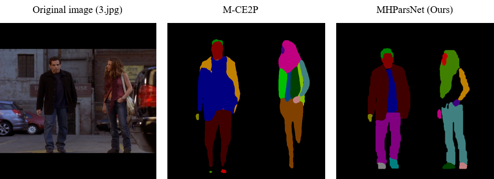

# MHParsNet

## Results
#### Comaprision of ```MHParsNet``` with state-of-the art algorithms using AP<sup>r</sup>, AP<sup>p</sup> and PCP
Except for [M-CE2P](https://github.com/RanTaimu/M-CE2P), the state-of-the-art algorithms enumerated in Table 1 could not be replicated. Some reasons include deprecated codes (libraries), inadequate documentation, and incompatible dependencies. For such algorithms (marked by∗), the backbone network's size (parameter count) is provided to give a general sense of the model's scale and complexity. Therefore, the entire model is expected to be significantly larger.


&nbsp;


### Parsing (segmentation) mask quality evaluation

**Figure 2.** Parsing (segmentation) result of MHParsNet on sample data from the [MHPV2](https://lv-mhp.github.io/dataset) validation dataset.
&nbsp;

Fig. 1 above shows the mask generation quality of MHParsNet. From Fig. 1, MHParsNet correctly detects and segments all human instances from the sample RGB image. Additionally, MHParsNet correctly detects and segments all but one body part. MHParsNet misses the ```Sunglasses``` object associated with the male subject, which reflects in the human and part instance mask prediction. However, this does not suggest that MHParsNet can not detect small objects; the abnormality is simply due to a false negative prediction. This assertion is validated by the fact that MHParsNet detects the relatively smaller ```Watch``` object on the wrist of the female subject. More test samples can be generated by executing ```test.py```.

&nbsp;
### Comparision of MHParsNet's mask quality with other state-of-the-art algorithms



e could not replicate the models enu-
merated in Table 1 to obtain the exact parameter counts.
In such instances (marked by∗), we provide the size of the
backbone network to give a general sense of the model’s
scale and complexity. Note that the entire model is expected
to be significantly larger.
