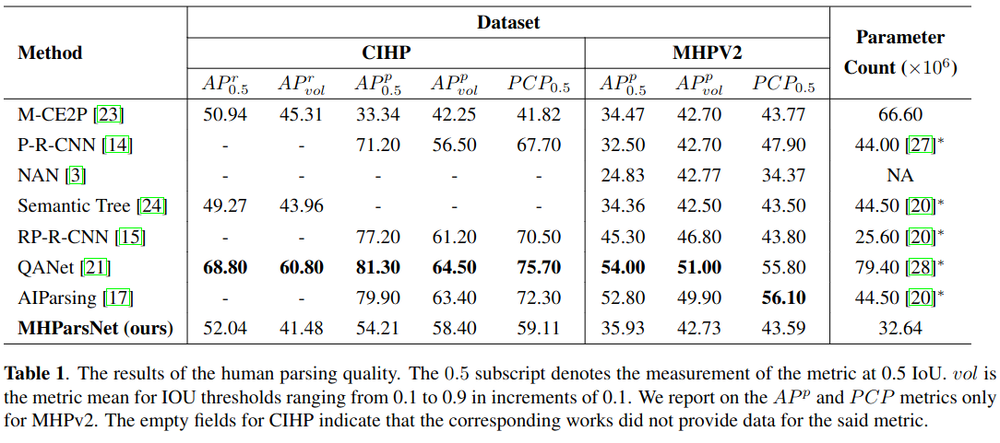
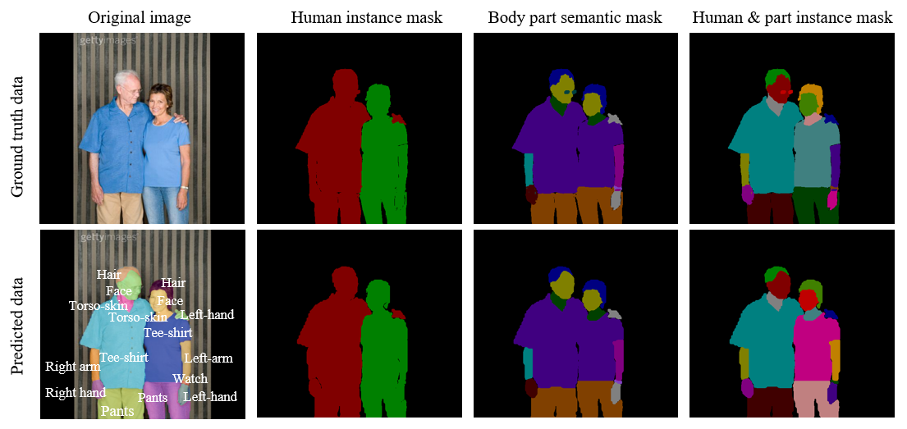
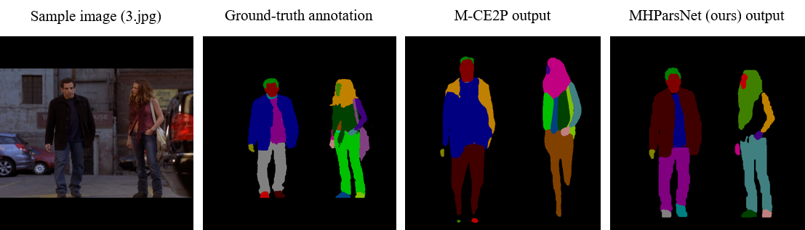

&nbsp;
> The codebase of this work will be made public after the publication of this work. For now, the codebase is available on request only. Please write to the authors via rockson.agyeman@aau.at or bernhard.rinner@aau.at for access or inquiry. Thank you.

&nbsp;

# Multi-Human Parsing Network (MHParsNet)
**Contribution Summary**:

This work presents **M**ulti **H**uman **Pars**ing **Net**work (**MHParsNet**), a resource-efficient multi-human parsing framework designed for resource-constrained embedded devices. MHParsNet leverages the grid cell concept of YOLO for object detection by incorporating segmentation mask generation for multi-human parsing. Despite the minimal resource requirement of ```MHParsNet```, it generates higher-quality segmentation (parsing) masks compared to select state-of-the-art algorithms. To validate our objective, we implemented ```MHParsNet``` on a smart camera prototype using the Nvidia Jetson embedded board and achieved 6 FPS (on average) at inference.  

&nbsp;

## Results
#### Comaprision of ```MHParsNet``` with state-of-the art algorithms using AP<sup>r</sup>, AP<sup>p</sup> and PCP
Except for [M-CE2P](https://github.com/RanTaimu/M-CE2P), the state-of-the-art algorithms enumerated in Table 1 could not be replicated. Some reasons include deprecated codes (libraries), inadequate documentation, and incompatible dependencies. For such algorithms (marked by∗), the backbone network's size (parameter count) is provided to give a general sense of the model's scale and complexity. Therefore, the entire model is expected to be significantly larger. Table 1 below presents the empirical multi-human parsing results of ```MHParsNet```.



&nbsp;


#### Evaluation: the quality of the parsing (segmentation) masks predicted by ```MHParsNet```


**Figure 1.** Parsing (segmentation) result of MHParsNet on sample data from the [MHPV2](https://lv-mhp.github.io/dataset) validation dataset.
&nbsp;

Fig. 1 above shows the mask generation quality of MHParsNet. From Fig. 1, MHParsNet correctly detects and segments all human instances from the sample RGB image. Additionally, MHParsNet correctly detects and segments all but one body part. MHParsNet misses the ```Sunglasses``` object associated with the male subject, which reflects in the human and part instance mask prediction. However, this does not suggest that MHParsNet can not detect small objects; the abnormality is simply due to a false negative prediction. This assertion is validated by the fact that MHParsNet detects the relatively smaller ```Watch``` object on the wrist of the female subject. More test samples can be generated by executing ```test.py```.

&nbsp;
#### Evaluation: comparision of ```MHParsNet's``` mask quality with other state-of-the-art algorithms
As aforementioned, except for [M-CE2P](https://github.com/RanTaimu/M-CE2P), the state-of-the-art algorithms enumerated in Table 1 could not be replicated. Therefore, the evaluation of the segmentation mask quality is performed between ```MHParsNet``` and ```M-CE2P``` only. The evaluation is performed on the [CIHP](https://sysu-hcp.net/lip/overview.php) and [MHPv2](https://lv-mhp.github.io/dataset) datasets, but the result of ```3.jpg``` from the [MHPV2](https://lv-mhp.github.io/dataset) validation dataset only is showed here.



**Figure 2.** Comparision of the segmentation (parsing) mask quality between ```MHParsNet```(ours) and ```M-CE2P```.

As shown in Fig. 2, `3.jpg` comprises two human instances; a male and a female subject. According to the ground truth annotation, the male subject possesses the following attributes: ```Hair```, ```Face```, ```Torso-skin```, ```Jacket/windbreaker/hoodie```, ```Singlet```,  ```Right-hand```,  ```Pants```, ```Left-shoe``` and ```Right-shoe```. The female subject on the other posses: ```Hair```, ```Face```, ```Singlet```, ```Right-arm```, ```Left-arm```, ```Right-hand```, ```Left-hand```, ```Backpack```, ```Pants```, ```Belt```, ```Left-shoe``` and ```Right-shoe```. 

For the male subject, ```M-CE2P``` makes a false negative prediction on the ```Torso-skin``` class, while for the female subject, it makes the following false negative mask predictions: ```Right-arm```, ```Right-hand```, ```Backpack```, ```Belt```, ```Left-shoe```, and ```Right-shoe```. ```M-CE2P``` also falsely predicts some other object classes in the upper body part of the female subject. On the other hand, our ```MHParsNet``` makes no false positive predictions in the upper body part of the female subject. Additionally, all but the ```Belt```, ```Torso-skin```, ```Right-arm```, and the ```Backpack``` classes are correctly predicted. For the male subject, ```MHParsNet``` misses the ```Torso-skin``` class only. From a visual perspective, it can be observed that despite having fewer trainable parameters, ```MHParsNet``` predicts higher quality segmentation masks than ```M-CE2P```.


&nbsp;
#### Evaluation: deployment on [Nvidia Jetson Nano](https://developer.nvidia.com/embedded/jetson-nano-developer-kit) embedded board
To evaluate the adaptability of MHParsNet on embedded devices, we conducted inference on a smart camera prototype using the [Jetson Nano](https://developer.nvidia.com/embedded/jetson-nano-developer-kit) embedded board and the [Logitecg C920 HD Pro Webcam](https://www.logitech.com/de-at/products/webcams/c920-pro-hd-webcam.960-001055.html). We used the [Ubuntu 20.04 OS image](https://github.com/Qengineering/Jetson-Nano-Ubuntu-20-image) from [Qengineering](https://github.com/Qengineering/Jetson-Nano-Ubuntu-20-image) to setup the operating system on the Nvidia Jetson Nano device. ```MHParsNet``` achieves 6 FPS on average on the smart camera prototype. With up to four human instances, ```MHParsNet``` achieves a maximum of 11 frames per second. The details of the code implementation are in ```camera_view.py```. Figure 3 below is an example of the output from the smart camera prototype.


**Figure 3.** Output of the smart camera prototype.


**Why do the colors of the segmentations keep changing?**
> The color pallets assigned to the segmentation masks are generated based on the number of predicted segmentation masks per video frame. Practically, it is impossible to forecast the number of people that may enter the field of view of a camera. Similarly, it is impossible to forecast the number of body parts (attributes) each person may posses; thus, it is impractical to set the number of color pallets to a fixed number. Therefore, for every video frame, the color pallets are generated according to the number of mask predictions, and this is why the colors of the class instances keep changing.

&nbsp;
## Requirements or dependencies

- Operating System: Ubuntu 20.04.6 LTS
- CUDA Version: 11.7
- python version: 3.10.11
- pytorch version: 1.13.1
- setuptools version: 67.8.0
- torchaudio version: 0.13.1
- torchvision version: 0.14.1
- pillow version: 9.4.0
- opencv-python version: 4.8.0.74
- tqdm version: 4.65.0
- numpy version: 1.25.0
- natsort version: 8.4.0


&nbsp;
## Other resources: dataset and pre-trained model
- CIHP: [download from here](https://sysu-hcp.net/lip/overview.php)
- MHPV2: [download from here](https://lv-mhp.github.io/dataset)
- Pre-trained model: [download from here](https://drive.google.com/drive/folders/166hl7qJVpgR7Z9KIELXUHM55FbgqhrHH?usp=sharing)

&nbsp;
## Setup
- Install dependencies. Complete list of dependencies is in ```requirements.txt```
- Download or clone MHParsNet repository
- Navigate into MHParsNet directory. ```cd /path/to/MHParsNet``` 
- Execute ```python setup.py develop```. On the Jetson Nano, do ```python setup.py develop --install-dir ~/```
- Download the [pre-trained model](https://drive.google.com/drive/folders/166hl7qJVpgR7Z9KIELXUHM55FbgqhrHH?usp=sharing), that is the entire model and the model with state dictionaries, and put them into ```MHParsNet/data/outputs/models/```

> Please make sure your ```nvcc``` version is the same as your ```cuda``` version. This work was done using CUDA Version 11.7. To check for ```nvcc``` version, do ```nvcc --version```, and to check for ```cuda``` version, do ```nvidia-smi```. See [https://stackoverflow.com/q/53422407/3901871](https://stackoverflow.com/a/76581411/3901871) for discussion and possible solution.


### Preparing datasets
The annotations in the CIHP dataset are grouped into ```semantic part segmentation```, ```semantic person segmentation```, and ```instance-level``` parsing labels.
The annotations in MHP are not grouped into semantic and instance categories. Rather for each image, the ground truth annotations are distributed across ```N``` images, where ```N``` denotes the number of human instances in the image. For convenience, we pre-processed all such annotations into the grouping format of CIHP. We used the [pre-processing library](https://github.com/RanTaimu/M-CE2P/blob/master/metrics/MHP2CIHP.py) provided by [RanTaimu](https://github.com/RanTaimu).

### MHPV2:
- Download and extract [MHPV2 dataset](https://lv-mhp.github.io/dataset) to, for example, ```~/Desktop/LV-MHP-v2```
- Execute ```python MHP2CIHP.py -d ~/Desktop/LV-MHP-v2```, assuming ```~/Desktop/LV-MHP-v2``` is the parent directory of the MHPV2 dataset


&nbsp;
## Inference / test
### Inference on single image
``` python evaluate.py```

&nbsp;
### Predict and save predicton images
> The ```predict_and_save.py``` script performs semantic and instance segmentation predictions on images. The predictions are saved as colored images. Additionally, it saves an acceleration  file by writing sematic classs and corresponding confidence scores to a text file. This file is important when computing the AP<sup>r</sup>, AP<sup>p</sup> and PCP metrics. The ouput is written to ```MHParsNet/data/outputs/instance_pred_folder``` and ```MHParsNet/data/outputs/semantic_pred_folder```.

``` python predict_and_save.py```

&nbsp;
### Smart Camera Prototype
> Set-up an [Nvidia Jetson Nano](https://developer.nvidia.com/embedded/jetson-nano-developer-kit) embedded board and a [Logitecg C920 HD Pro Webcam](https://www.logitech.com/de-at/products/webcams/c920-pro-hd-webcam.960-001055.html) as the smart camera prototype. Download and use the [Ubuntu 20.04 OS image](https://github.com/Qengineering/Jetson-Nano-Ubuntu-20-image) from [Qengineering](https://github.com/Qengineering/Jetson-Nano-Ubuntu-20-image) to setup the operating system on the Jetson Nano device. The libraries provided by the Ubuntu 20.04 OS image should be sufficient, but where neccessary [install the dependencies](https://gitlab.aau.at/roagyeman/mhparsnet#requirements-or-dependencies), and follow all steps in the [Setup](https://gitlab.aau.at/roagyeman/mhparsnet#setup). Then execute

``` python camera_view.py```
